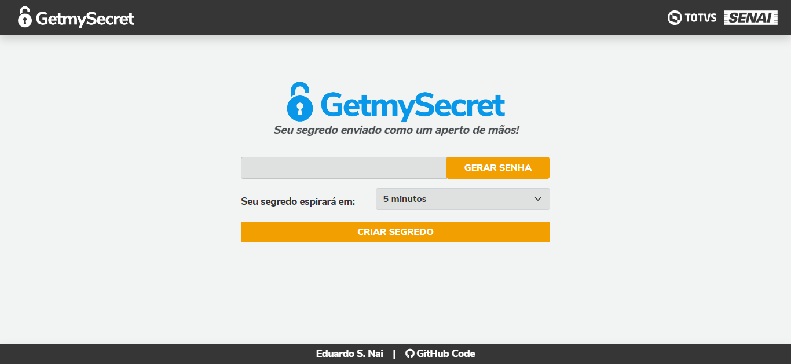
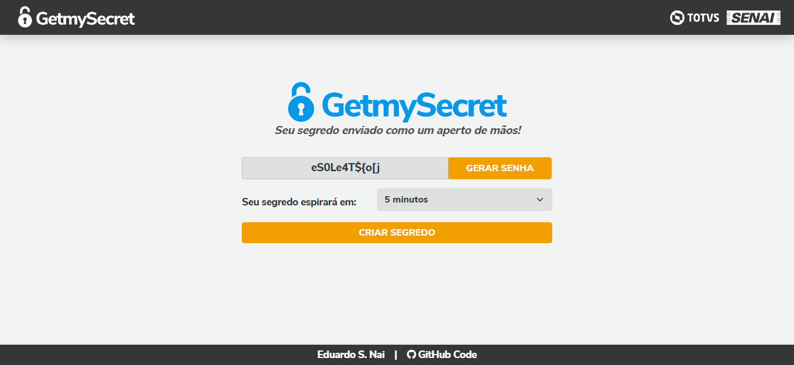
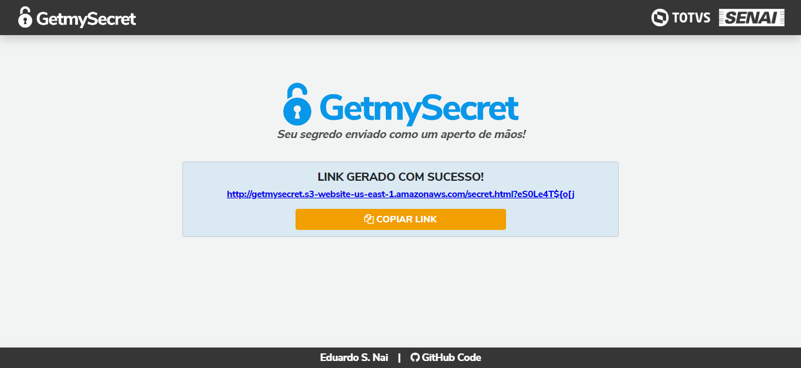
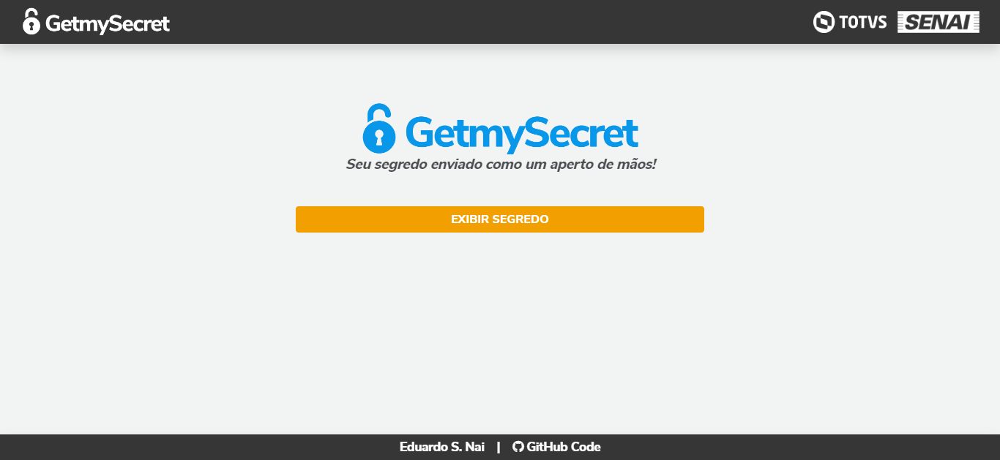
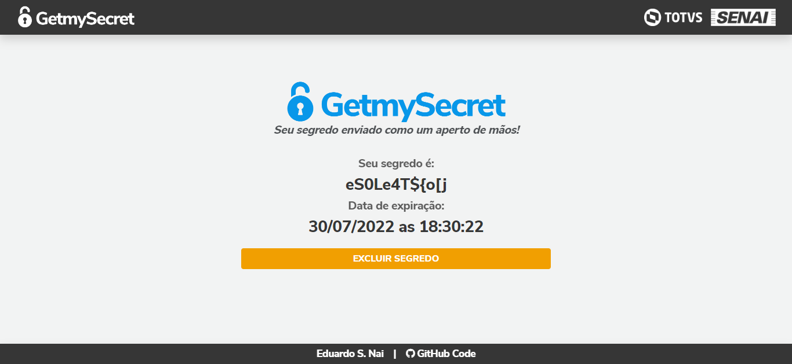
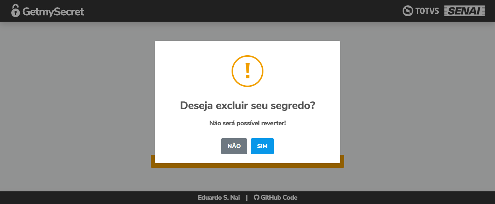
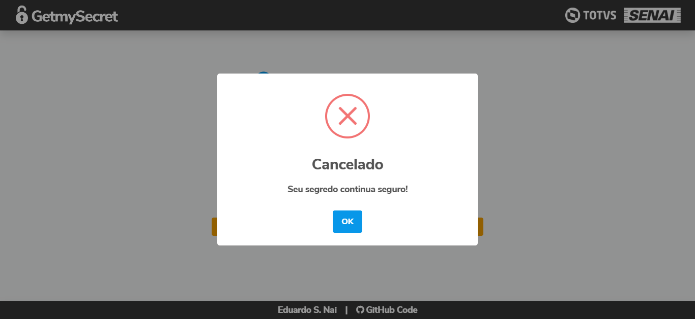
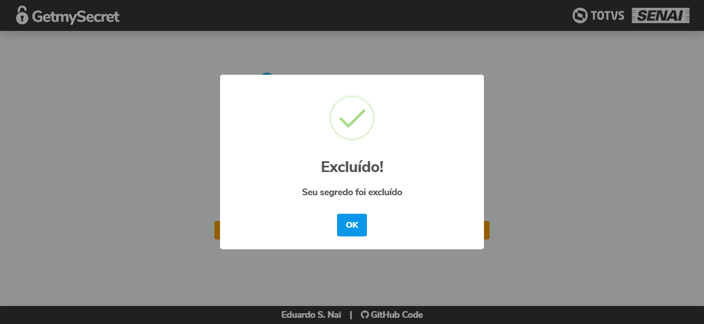
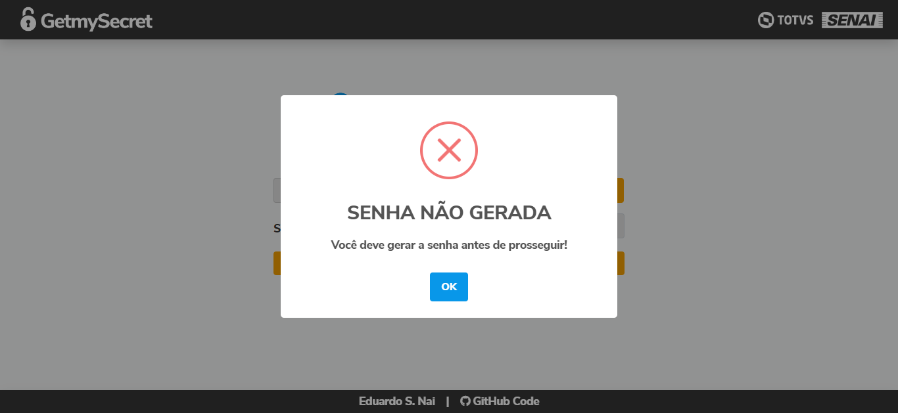
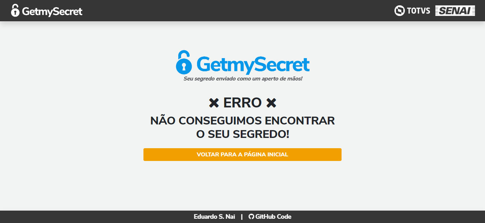

<p align="center">
  <a href="http://getmysecret.s3-website-us-east-1.amazonaws.com/"></a>
</p>
<h1 align="center">Seu segredo enviado como um aperto de mãos!</h1>
<h4 align="center" id="sobre"><i>GetmySecret nada mais é do que um sistema que permite o envio de informações sensíveis entre a área de suporte e o cliente de forma segura. O sistema não grava nenhuma informação definitivamente em seu banco de dados e também não identifica quem enviou ou quem receberá a informação.</i></h4>
<p align="center">
  
  
  
</p>
<h3 align="center">:rocket: EM DESENVOLVIMENTO...</h3>

---

<h3>
  <p align="center" id="indice">
    :arrow_right:
    <a href="#sobre">Sobre</a> •
    <a href="#indice">índice</a> • 
    <a href="#features">Features</a> • 
    <a href="#uso">Como usar</a> • 
    <a href="#tecnologias">Tecnologias</a>
    :arrow_left:
  </p>
</h3>

---

<h3 id="features">:ballot_box_with_check: FEATURES</h3>

- [x] Criação de senha segura
- [x] Criação de link para acesso
- [x] Controle de segredo

<h2 id="uso">:interrobang: COMO USAR</h2>

Link de acesso:
```
http://getmysecret.s3-website-us-east-1.amazonaws.com
```



> :house: **PÁGINA INICIAL**

<br>



> :house: **PÁGINA INICIAL** --> Após clicar no botão "GERAR SENHA"

<br>



> :link: **LINK GERADO** --> Após gerar a senha, escolher o tempo de vida do segredo e clicar no botão "CRIAR SEGREDO"

> :warning: **O BOTÃO "COPIAR LINK" ATUALMENTE NÃO FUNCIONA, POIS O SITE NÃO POSSUÍ PROTOCOLO HTTPS**

<br>



> :lock: **SEGREDO**

<br>



> :lock: **SEGREDO** --> Após clicar no botão "EXIBIR SEGREDO"

<br>



> :lock: **SEGREDO** --> Após clicar no botão "EXCLUIR SEGREDO"



> :lock: **SEGREDO** --> Se o usuário clicar no botão "NÃO"



> :lock: **SEGREDO** --> Se o usuário clicar no botão "SIM"

<br>

<h3>:bulb: TRABALHANDO COM SUPOSIÇÕES...</h3>

<br>



> :house: **PÁGINA INICIAL** --> Se o usuário tentar prosseguir sem gerar a senha

<br>



> :x: **PÁGINA DE ERRO** --> Se a aplicação não encontrar o segredo no banco de dados

<br>

<h2 id="tecnologias">:wrench: TECNOLOGIAS</h2>

As seguintes ferramentas foram utilizadas na construção do projeto:

- ``HTML5``
- ``CSS3``
- ``Python``
- ``Javascript``
- ``Bootstrap 5``
- ``SweetAlert2``
- ``Font Awesome 4``

---
